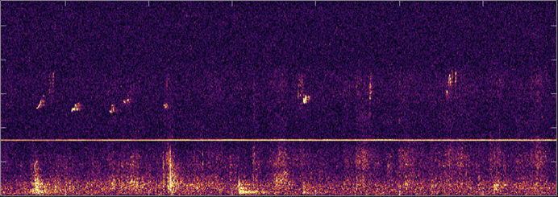
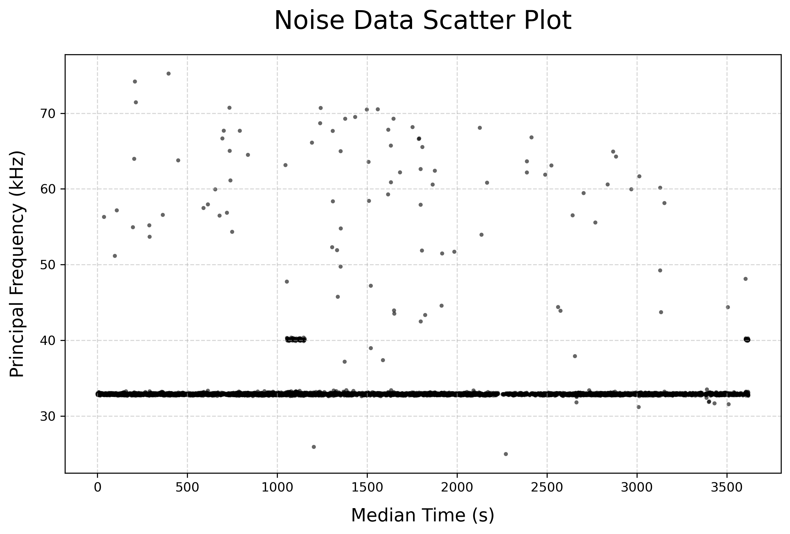

# Rat Ultrasonic Vocalization Identification 🐀

## Index
1. [Introduction](#1-introduction)
2. [Exploratory Data Analysis (EDA)](#2-exploratory-data-analysis-eda)
3. [Noise Cleaning](#3-noise-cleaning)
4. [Model and Threshold](#4-model-and-threshold)
5. [Conclusion](#5-conclusion)

## 1. Introduction

This project was developed to assist a professor in identifying rat ultrasonic vocalizations (USVs) in their natural habitat. The primary goal is to automate the conversion of raw acoustic data into accurate spectrograms, laying the groundwork for comprehensive future data analysis.

## 2. Exploratory Data Analysis (EDA)

Exploratory Data Analysis in this project begins with visualizing the spectrograms that are laden with various noises and artifacts. An initial assessment of accuracy is presented in tabular form, which establishes a benchmark for further processing and analysis.

*Figure: A sample spectrogram of rat vocalizations with background noise and a constant noise line.*

*Table: Initial State  Metrics*
| Metric      | Value (%) |
|-------------|-----------|
| Precision   | 6.6      |
| Recall      | 8.1     |
| F1-Score    | 7.3     |

## 3. Noise Cleaning

### 3.1 Locating the noise range

Calculated the median and IQR of the noise frequency data.

*Figure: The distribution of noise.*

**32.468 to 33.274 kHz includes 96.37% of the points.**

### 3.2 Bandstop Filter 
