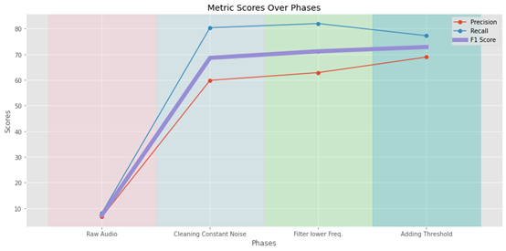

# Rat Ultrasonic Vocalization Identification 🐀

## Index
1. [Introduction](#1-introduction)
2. [Exploratory Data Analysis (EDA)](#2-exploratory-data-analysis-eda)
3. [Noise Cleaning](#3-noise-cleaning)
4. [Model and Threshold](#4-model-and-threshold)
5. [Conclusion](#5-conclusion)

## 1. Introduction

This project was developed to assist a professor in identifying rat ultrasonic vocalizations (USVs) in their natural habitat. The primary goal is to automate the conversion of raw acoustic data into accurate spectrograms, laying the groundwork for comprehensive future data analysis.

## 2. Exploratory Data Analysis (EDA)

Exploratory Data Analysis in this project begins with visualizing the spectrograms that are laden with various noises and artifacts. An initial assessment of accuracy is presented in tabular form, which establishes a benchmark for further processing and analysis.

*Figure: A sample spectrogram of rat vocalizations with background noise and a constant noise line.*

*Table: Initial State Metrics*
| Metric      | Value (%) |
|-------------|-----------|
| Precision   | 6.6      |
| Recall      | 8.1     |
| F1-Score    | 7.3     |

## 3. Noise Cleaning

### 3.1 Locating the noise range

Calculated the median and IQR of the noise frequency data.

*Figure: The distribution of noise.*

**32.468 to 33.274 kHz includes 96.37% of the points.**

### 3.2 Bandstop Filter 
Since the noise is highly concentrated in a small range of frequency, it is natuarl to use bandstop filter for noise cleaning.The bandstop filter is designed to attenuate frequencies within a defined suppression band while leaving other frequencies relatively unaffected.  
  
The filter is implemented using the scipy.signal package in Python, which provides the ‘butter’ function to generate the filter coefficients (b,a) for the desired bandstop characteristics. The signal is then processed using the filter function, applying the coefficients to the input data.  

*Table: Metrics After Cleaning Noised*
| Metric      | Value (%) |
|-------------|-----------|
| Precision   | 59.87      |
| Recall      | 80.39     |
| F1-Score    | 68.63     |

### 3.2 Filtering lower frequency
Perform further analysis on lower frequencies (below 20kHz) to understand their patterns.
  

*Figure: Primary Frequency Distribution.*  

Noting that there is no Call under 21k Hz, so next step is to filter frequency lower than 21k Hz.  

  

*Figure: Waveplot comparison of before and after filtering.*  

Processed audio has less variation in amplitude compared to the original, indicating that the filtering has reduced noise or unwanted frequencies, thus making the desired signal more prominent.  

*Table: Metrics After Filtering Lower Frequency*
| Metric      | Value (%) |
|-------------|-----------|
| Precision   | 62.89      |
| Recall      | 82.02     |
| F1-Score    | 71.19     |

## 4. Model and Threshold
The software I am using in the project, is DeepSqueak, in which the in-built function is YOLO model. The YOLO (You Only Look Once) model is a fast object detection system that processes images in one pass, predicting what objects are in the image and where they are with a single look. This makes it much quicker than other methods that scan the image multiple times, which is why it's popular for tasks needing speed, like video analysis.  

Threshold parameter determines the confidence level required by the model to label an event as a call. By increasing the threshold to 0.55. This adjustment aimed to strike a balance between sensitivity and specificity. Post-adjustment, we observed a notable increase in precision: from approximately 47% to 53.39%. 

*Table: Applying Threshold*
| Metric      | Value (%) |
|-------------|-----------|
| Precision   | 68.93      |
| Recall      | 77.28     |
| F1-Score    | 72.86     |

## 5. Conclusion

  

*Figure: Performance Improvement.*  

By cleaning audio noises and applying threshold, I successfully demonstrated how enhancements in audio preprocessing and DeepSqueak’s neural network algorithms significantly improve the detection and analysis of rodent ultrasonic vocalizations.
